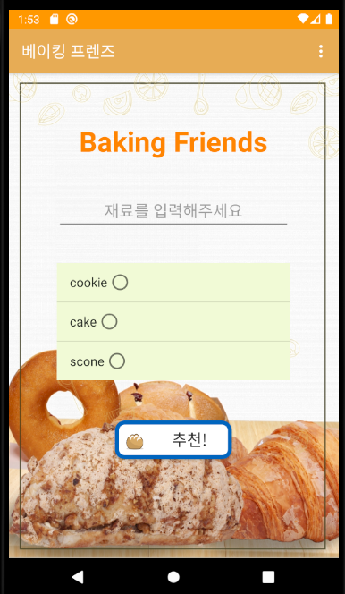
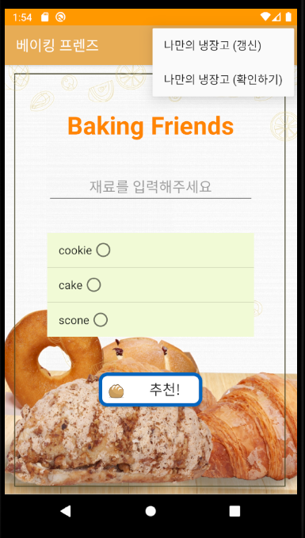
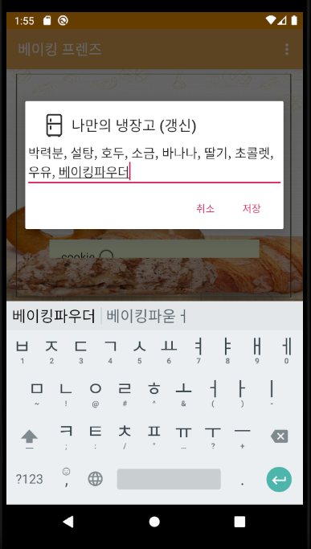
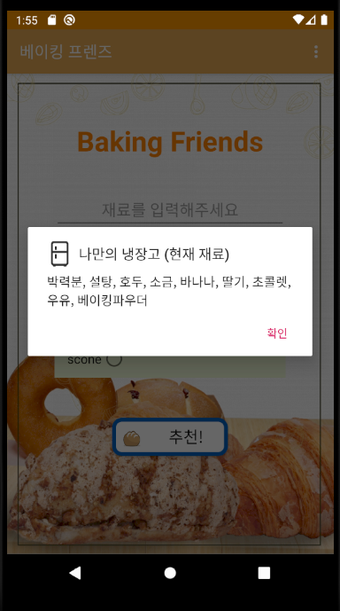
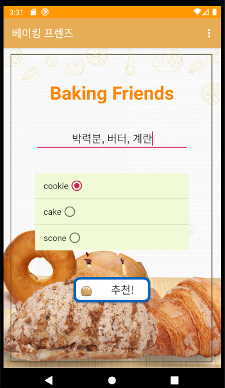
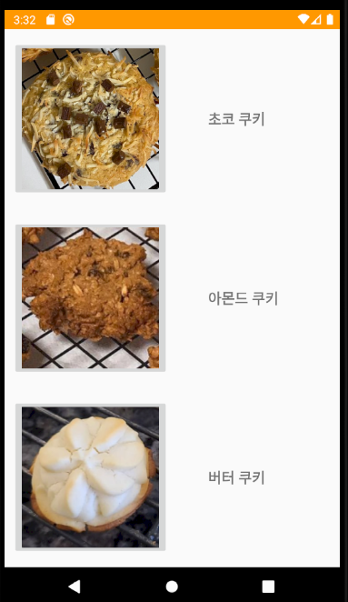
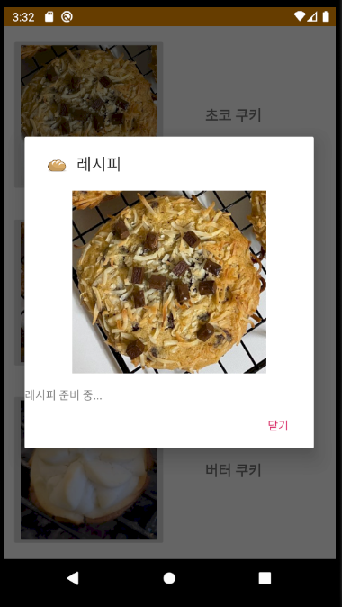
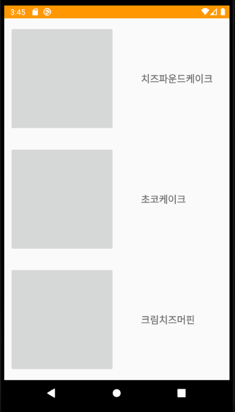

베이킹 프렌즈
=============

## [모바일프로그래밍]  
**2반 15팀 20170393 이현우, 20171453 장재혁**

<hr/>

## BackGround / 배경 설명

**NEW트렌드 = 홈 베이커즈**

```
코로나 바이러스가 극심해지면서 많은 사람들은 올 한해를 집에서 많은 시간을 보냈다.
그 때문인지 홈 DIY 취미가 늘어나는 추세이며, 핫한 주제가 홈 베이킹이었다.
취미로 시작을 한만큼 쉽고 접근하기 편한 레시피를 찾는건 물론이고 웬만하면 집에 있는 재료로 베이킹을 하고자 하는 사람들이 대부분이다.
```


**Q. 집에 재료가 얼마 없는데 오늘은 무엇을 베이킹할까?**

```
새로운 도전을 하고 싶을 땐 대량의 재료를 구매할 용기가 있지만 항상 그런 것은 아니다. 
오늘은 집에 있는 재료와 소량의 소비로 빵을 굽고 싶을 때가 있다. 
그럴 때 마다 빵의 레시피를 일일이 검색하다 시간을 낭비해 굽지 못하는 날도 많다. 
```


**Q. 적당하게 구울 베이커리를 찾는 수고를 줄일 수는 없을까?**
```
본인이 가지고 있는 재료로 편하게 구울 수 있는 베이커리를 추천 받으면 매번 일일이 탐색을 할 필요가 없다.
```
<hr/>

## Execution1 / 실행1 - 나만의 냉장고 기능

 **첫 실행 화면** 

 **오른쪽 상단에 있는 메뉴를 클릭하면 "나만의 냉장고" 항목이 표시** 

 **나만의 냉장고(갱신)을 통해 해당 에디트텍스트에 현재 자신이 가지고 있는 재료를 기록,저장 할 수 있다.** 

 **나만의 냉장고(확인하기)를 통해 기록해뒀던 "현재 재료" 목록을 확인할 수 있다** 


<hr/>

## Execution2 / 실행2 - 베이커리 추천 기능

 **재료입력, Bread 종류를 선택**

 **추천버튼을 누르면 알고리즘을 통해 해당 재료와 가장 가까운 Bread 3개를 추천한다.**

 **Bread를 선택하면 레시피 대화상자를 출력한다.(레시피는 추후 업데이트 예정)**


<hr/>


## Notice / 

 <== **아직 대부분 Bread들의 사진, 레시피들이 누락되어 있습니다.**

**많은 쿠키,케이크,스콘 종류의 사진, 레시피들은 추후 계속 업데이트 될 예정입니다.**


## Responsible part / 담당 부분

* 20170393 이현우 - Front end
* 20171453 장재혁 - Back end


## Reference / 참고

* https://www.economist.com/graphic-detail/2020/04/08/home-baking-is-on-the-rise-thanks-to-coronavirus-lockdowns
* http://www.homebakery.pe.kr/index_bread.html
* https://www.10000recipe.com/index.html
